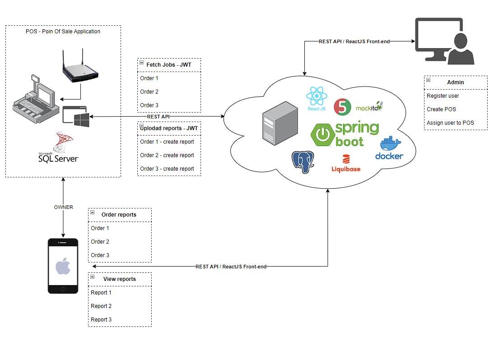

### PosReportsServer: Bridging the Gap Between On-Site POS Systems and Remote Access

In many cases, Point of Sale (POS) systems, also known as cash registers, are traditionally desktop applications, often tucked away behind routers in physical locations. This can pose a challenge for business owners who need access to critical reports and data from their POS systems when they are away from the premises.

PosReportsServer is designed to address this challenge by providing a cloud-based solution that seamlessly connects the owner to their POS system, regardless of their physical location. This application serves as an intermediary, residing in the cloud, which receives the owner's requests for data. It works in tandem with the local POS application, pulling these requests, processing them, and securely delivering the requested data to the cloud server. This enables business owners to conveniently access and review the vital information they need from their POS system, anytime and anywhere.



* PostgreSQL
* Spring Boot
* JUnit and Mockito
* REST API
* React.js
* Liquibase
* Docker


#### Build and Run Spring Boot PosReportsServer application
```
$ cd <your PosReportsServer folder>
$ mvnw clean install
$ mvnw spring-boot:run
```
Note: app by default using profile with in-memory H2 database

#### Generate test report
```
$ cd <your PosReportsServer folder>
$ mvn surefire-report:report
```
Report will be generated at:
```
$ <your PosReportsServer folder>/target/site/surefire-report.html
```

#### TODO:
* Add validation
* Add OpenAPI swagger
* Add Front-end
* Additional tests
* Demo for GitlabCI
* Follow with JUnit coverage